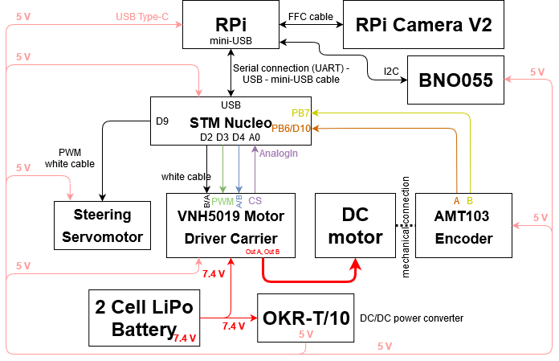
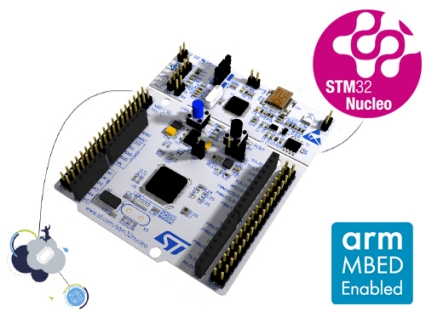
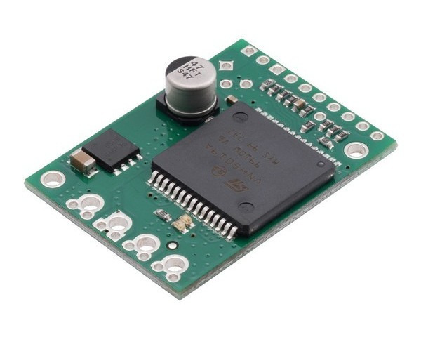
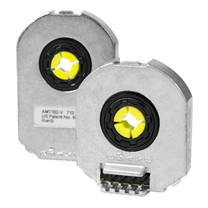
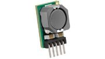
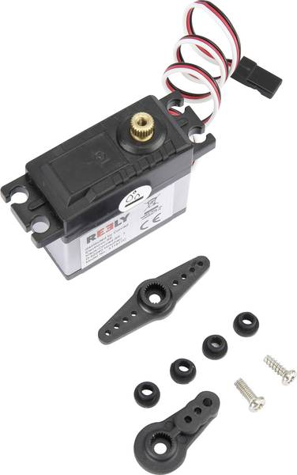
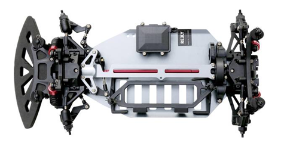
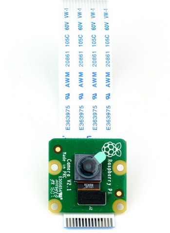
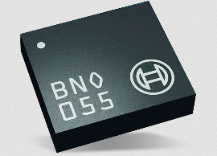

Connection diagram and components
=================================

In this section the main components are listed, together with the connection diagram. 
In the following schematics you can see a simple connections diagram. The GPIO lines are marked on each components.

NucleoF401RE
------------

It's a micro-controller low level control. Here are some links: 
    - `Official site of NucleoF401RE`_ 
    - `Nucleo - Useful link 1`_ 
    - `Nucleo - Useful link 2`_  

.. _`Official site of NucleoF401RE`: https://www.st.com/en/evaluation-tools/nucleo-f401re.html
.. _`Nucleo - Useful link 1`: https://www.youtube.com/watch?v=plzmC6lDR3o
.. _`Nucleo - Useful link 2`: https://www.youtube.com/watch?v=weag4UxassY

Raspberry Pi 4 Mobel b
-----------------------

.. image:: images/Components/RaspberryPi4.jpg
   :align: center
   :scale: 40%

It's a single board computer for high level control and features. The given version has 4GB/2GB RAM memory. Here are some links:
    - `Official site of Raspberry Pi 4`_
    - `RPI4 - Useful link`_

.. _`Official site of Raspberry Pi 4`: https://www.raspberrypi.org/products/raspberry-pi-4-model-b
.. _`RPI4 - Useful link`: https://www.youtube.com/watch?v=BpJCAafw2qE

VNH5012 H-bridge Motor Driver
-----------------------------

It's H-bridge for dc motor. Here are the links:
    - `Official site of VNH5019`_ 
    - `VNH - Useful link`_ 

.. _`Official site of VNH5019`: https://www.pololu.com/product/1451
.. _`VNH - Useful link`: https://www.youtube.com/watch?v=9ShJ6IH0ZLs

AMT103 Encoder
--------------

It's a high accuracy incremental encoder. Here are some links:
    - `Official site of AMT103`_ 
    - `Encoder - Useful link`_ 
    
.. _`Official site of AMT103`: https://www.cuidevices.com/product/motion/rotary-encoders/incremental/modular/amt10-series
.. _`Encoder - Useful link`: https://www.youtube.com/watch?v=k2GQVJ4z0kM

DC/DC Converters
----------------

It's a OKR-T/10-W12-C non-Isolated dc/dc converter to generate a 5V for supplying the components. Here are some links:
    - `Official site of converter`_
    - `Converter - Useful link`_

.. _`Official site of converter`: https://power.murata.com/okr-t-10-w12-c.html
.. _`Converter - Useful link`: https://www.youtube.com/watch?v=vmNpsofY4-U

Servo motor
------------

It's a Reely RS610WP Servo Motor. Links:
    - `Technical documentation (RS610WP)`_
    - `Servomotor - Useful link`_

.. _`Technical documentation (RS610WP)`: https://www.conrad.com/p/reely-standard-servo-rs-610wp-mg-analogue-servo-gear-box-material-metal-connector-system-jr-2141322
.. _`Servomotor - Useful link`: https://www.youtube.com/watch?v=ditS0a28Sko

Battery
-------

Two types of batteries were give:  
Topfuel Lipo battery 20C-ECO-X with capacity 5000MAH and two cells or 7.4 V 5500 mAh No. of cells: 2 20 C Softcase XT90. 
or 
Conrad energy Scale model battery pack (LiPo) 7.4 V 5500 mAh No. of cells: 2 20 C Softcase XT90

Here you can see some info: `Battery info`_

.. _`Battery info`: https://www.youtube.com/watch?v=ogb0DTqsZEs

Chassis
-------

It's a Reely TC-04 Onroad-Chassis 1:10, RC model car Electric Road version 4WD ARR. Here is the user manual: `Reely TC-04 Onroad-Chassis 1:10`_

.. _`Reely TC-04 Onroad-Chassis 1:10`: https://asset.conrad.com/media10/add/160267/c1/-/gl/001406735ML02/manual-1406735-reely-tc-04-onroad-chassis-110-rc-model-car-electric-road-version-4wd-arr.pdf

Camera
-------------

It's a PiCamera v2.1. Here is a useful link `PiCamera v2.1`_

.. _`PiCamera v2.1`: https://picamera.readthedocs.io/en/release-1.13/

Smart IMU
------------------

It's a smart IMU sensor, BNO055 . Here are some links: 
    - `Usage Manual(Smart sensor: BNO055)`_
    - `IMU - Useful link`_

.. _`Usage Manual(Smart sensor: BNO055)`: https://www.bosch-sensortec.com/products/smart-sensors/bno055.html
.. _`IMU - Useful link`: https://www.youtube.com/watch?v=Bw0WuAyGsnY&ab_channel=BoschSensortec
