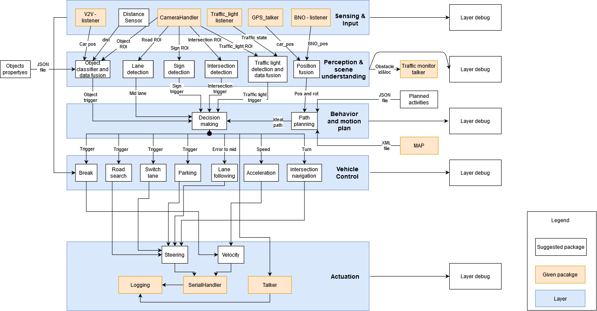
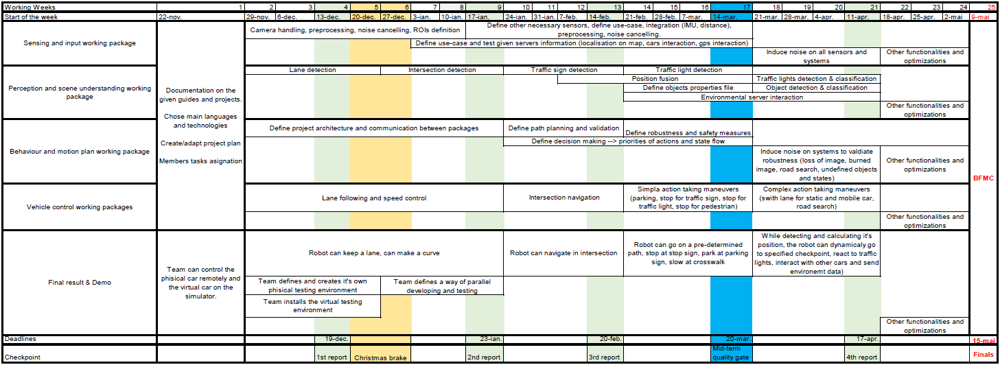
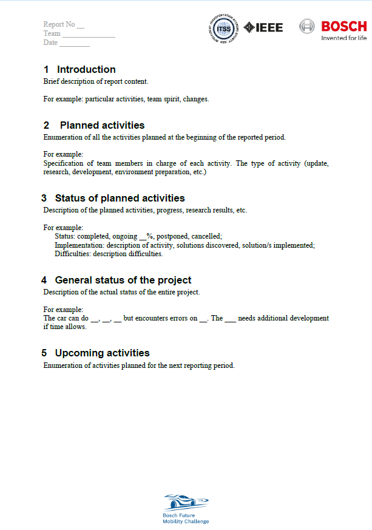

Periodic status and examples
=============================

Each selected team has to send an updated project plan, a report and a video in each month on the communicated platform, whithin the communicated time-frame.

**The information described below is only presented as an example. You have to create your own documents in order to organize and present your team work.
If used as it is, without adaptation to the team needs and plan, the team may lose points on the evaluation. We highly encourage you to adapt the models 
while under development to the actual status of the project.**

We recommend to first make software architecture. The architecture, is usually used in industry in order to have an overview of the project modules and the 
communication between them. This helps parallel development, features addition, debugging and portability of the modules to other projects. By having a strong 
architecture, you can make a project plan with deadlines, efforts, parallelness and dependencies, so that all the team components can work in the same time 
without depending completly on other colleagues/modules and still respecting all the checkpoints of the project, reppresented in the time plan. 

Periodic reports are usually sent in industry so that the clients always know the status of the requested projects. We all know the saying "an image worth 1000 words", so 
in order to strengthen our view on your project, a multimedia file is required, emphasizing the actual work from the last month.

Following, you can see some examples of the requested documents.


Project plan and architecture
`````````````````````````````````
Here is an example of a proposed layered and modular architecture



Here is an example of a projec plan(a time table and it's task list) based on the proposed architecture architecture

Project plan



Monthly report
````````````````````
Recommended report length is one/two page/2. Maximum report length is 3 pages.



Media documents
````````````````````
It can be in video format or images format. The size of the video shluld not exceed 15 MB.