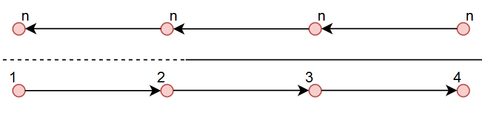

V2X - Vehicle to everything
============================

For all the V2X communications to work, all the cars RPi (or computers replaced) will have to be connected to the LAN. Prior the competition, the teams will 
share with the organizers the MAC of the car computer and two other computers used for development & connection at the location.

API's are given in the brain project for interaction with all the systems, together with simulated servers (or components) in order to ensure that the 
real systems will interact with yours in a propper manner.

Localization system and mapping
''''''''''''''''''''''''''''''''''
An indoor localization system is available. It aims to detect and send upon connection the relative position for each robot on the race track. The localization 
system has three main components: server, robot client and camera client. The server collects the data from the camera client(position of the car on the camera), 
calculates the position of the cars o the system and serves the robot clients with theirs coordination. 

Technical data of the system:
 - The frequency of the given messages is 3-4 Hz
 - The error of the system is about ~10 cm
 - The delay of the received messages is ~0.4 seconds
 - Some areas do not have coverage. 
 - The last detected position is stored and served. If the position is older then 2 seconds it is discarded.

A digital map is provided in order to help the teams navigate in the environment. The map is saved in XML format and it is exported with the help of the GraphML 
library (making it easier to be imported on your platform). There are two types of information: Nodes and Connections. Each node is placed in the middle o a lane 
and the distance between 2 nodes(on the same lane) will be roughly ~30 cm, with some variations. A connection describes the relations between twp nodes (dotted 
or continuous line). Here you can see a straight road visual example:



Every node has 3 attributes: Id, X coordinate, Y coordinate. On the connectivity table instead, we have the start node id, the end node id and the type of 
connection (straight or dotted road: TRUE or FALSE). 

+------+-------+-------+--------+--------+----------+
| Nodes table          | Connections table          |
+======+=======+=======+========+========+==========+
|  id  |   X   |   Y   |  Id_1  |  Id_2  |  Dotted  |
+------+-------+-------+--------+--------+----------+
|   1  |  3.6  |  2.4  |   1    |   2    |   TRUE   |
+------+-------+-------+--------+--------+----------+
|   2  |  4.0  |  2.4  |   2    |   3    |   FALSE  |
+------+-------+-------+--------+--------+----------+
|   3  |  4.4  |  2.4  |   3    |   4    |   FALSE  |
+------+-------+-------+--------+--------+----------+
|   4  |  4.8  |  2.4  |                            |
+------+-------+-------+--------+--------+----------+


In the intersections case, there will be 3 points with the same coordinates for a 3 roads intersection(A1, A2, A3) and 4 points for a 4 roads intersection(A1, 
A2, A3, A4). This symbolization is done so to simulate a layered highway intersection, and so, helping you plan the path without taking into consideration U 
turn cases inside the intersection (if we only have a single point connected to all the nodes, then a turn like 18-A-17 would be possible). The representation 
is done in the following images.

+---------------------------------------+---------------------------------------+
| .. image:: images/3roadsExample.PNG   | .. image:: images/4roadsExample.PNG   |
+---------------------------------------+---------------------------------------+

You can find the figure and the digital representation on the following links: 
 - `Test track figure`_
 - `Test track digital`_
 - `Competition track figure`_
 - `Competition track digital`_

  .. _`Test track figure`: https://github.com/ECC-BFMC/Documentation/blob/master/source/images/Test_track.png
  .. _`Test track digital`: https://github.com/ECC-BFMC/Documentation/blob/master/source/templates/Test_track.graphml
  .. _`Competition track figure`: https://github.com/ECC-BFMC/Documentation/blob/master/source/images/Competition_track.png
  .. _`Competition track digital`: https://github.com/ECC-BFMC/Documentation/blob/master/source/templates/Competition_track.graphml

  The coordinates systems of the maps can be found here:
  - `Test track coordinate system`_
  - `Competition track coordinate system`_
  
     .. _`Test track coordinate system`: https://github.com/ECC-BFMC/Documentation/blob/master/source/templates/Track_Test.png
     .. _`Competition track coordinate system`: https://github.com/ECC-BFMC/Documentation/blob/master/source/templates/Track.png

Semaphore
''''''''''

Each semaphore broadcast messages with a frequency of 10 Hz, including the semaphore id and it's state.

Semaphore State
`````````````````
The states of the semaphores are described in the following table

=============  =============  =============
 Semaphore State
-------------------------------------------
      0              1              2
=============  =============  =============
     RED          YELLOW          GREEN
=============  =============  =============

Cycle
`````````````````
The cycle of each semaphore is described in the table below

=============  =============  =============  =============  =============
 Semaphore cycle
-------------------------------------------------------------------------
    State          State           State          State         State
=============  =============  =============  =============  =============
     RED          YELLOW          GREEN          YELLOW          RED
=============  =============  =============  =============  =============


Environmental server
'''''''''''''''''''''
An environmental server will be available at the location. The car will have to send to it the position (with 0.5 meter radious error) the position and
the id of the encoutnered obstacle. Down below, you can see the table with the id and description of the obstacles.

+------+------------------------+
| ID   | Description            |
+======+========================+
|   1  | TS - Stop              |
+------+------------------------+
|   2  | TS - Priority          |
+------+------------------------+
|   3  | TS - Parking           |
+------+------------------------+
|   4  | TS - Crosswalk         |
+------+------------------------+
|   5  | TS - Highway entrance  |
+------+------------------------+
|   6  | TS - Highway exit      |
+------+------------------------+
|   7  | TS - Roundabout        |
+------+------------------------+
|   8  | TS - One way road      |
+------+------------------------+
|   9  | Traffic light          |
+------+------------------------+
|  10  | Static car on road     |
+------+------------------------+
|  11  | Static car on parking  |
+------+------------------------+
|  12  | Pedestrian on crowwalk |
+------+------------------------+
|  13  | Pedetrian on road      |
+------+------------------------+
|  14  | Roadblock              |
+------+------------------------+
|  15  | Bumpy road             |
+------+------------------------+

TS - Traffic Sign

V2V - Vehicle to vehicle communicaiton
''''''''''''''''''''''''''''''''''''''''
The dinamic obstacles (moving cars) will stream their position on the map via WiFi UDP messages, including the car id and it's position. 
The frequency of the sent messages will be of 4 Hz and the accuracy will be of 10 cm radious. 